# Библиотечное WEB CRUD приложение

# Используемые технологии
* **Java**
* **PostgreSQL**
* **Spring MVC**
* **Hybernate**
* **Thymeleaf**
* **Tomcat**
* **Maven**

# Структура базы данных
В базе данных предусмотрены все возможные проверки значений **Check**,
а так же проверки на **NULL**
все **Foreign key** удаляется через **Cascade**

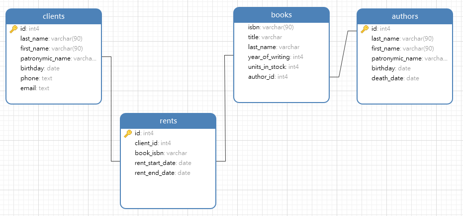

Для быстродействия используются **View**

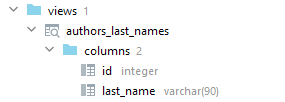

# WEB приложение кратко
В приложении есть все атрибуты **CRUD**
Можно просматривать, создавать, редактировать и удалять сущности.

Для структуры выбрат паттерн **Model View Controller**
А так же исопльзуется прослойка **Data Access Object** между контроллером и Базой данных

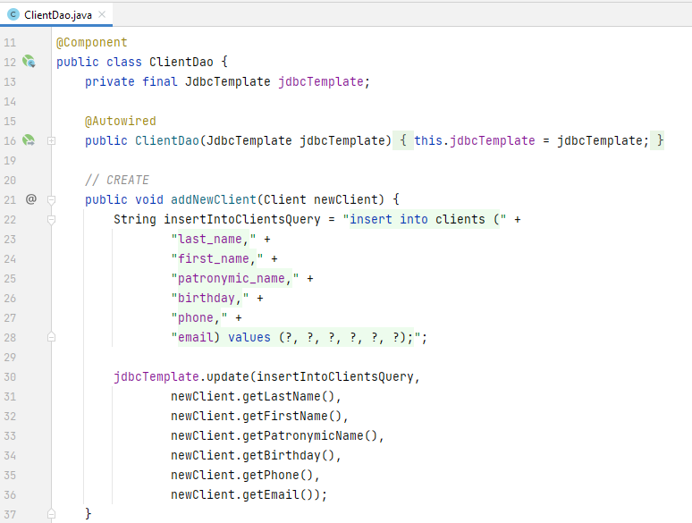

Вунтри **DAO** используется **jdbcTemplate** для исполнения запросов.
Специально для него написан **RowMapper**

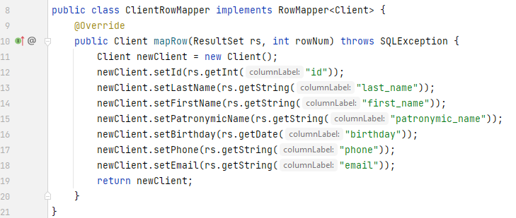

**Скриншоты страниц:**

**Клиенты библиотеки**

Пример страницы со списком всех клиентов библиотеки

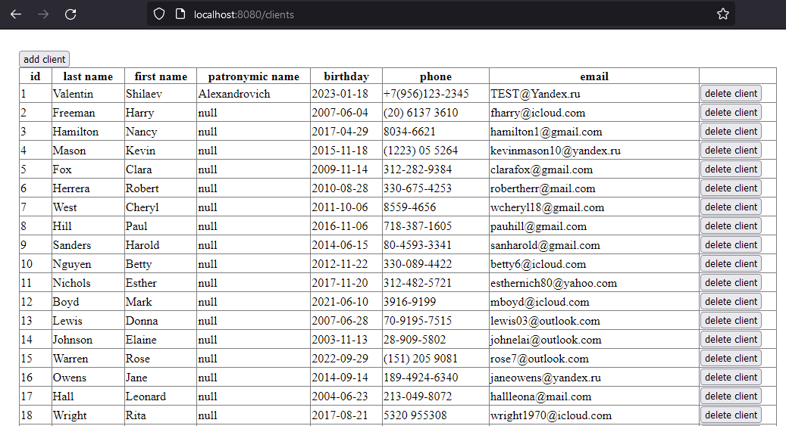

Если нажать на любую строку в списке клиентов, то мы перейдем на страницу клиента
Здесь есть кнопки управления этим клиентом, например можно его изменить

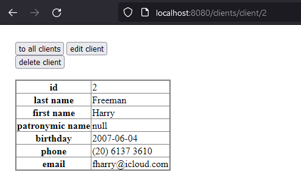

Страница с добавлением нового клиента. Все поля дважды проверяются,
сначала средствами Базы данных **Check** и другие ограничения,
затем с помощью **Hybernate Validator** и **Validator** из библиотеки **Springframework**

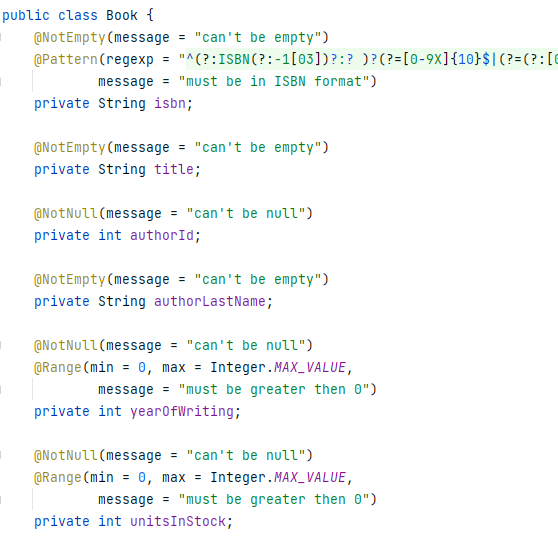

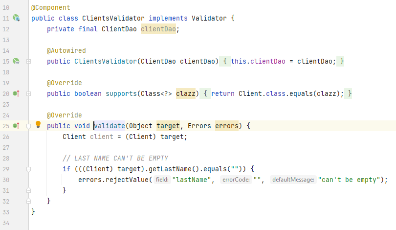

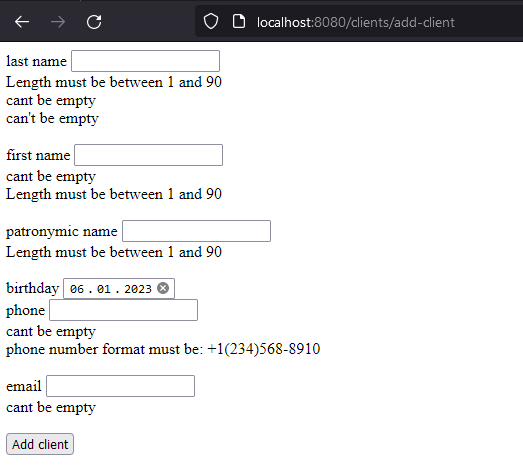

Точно такой же функционал, как и с клиентами есть у книг, авторов и аренды

**Книги**

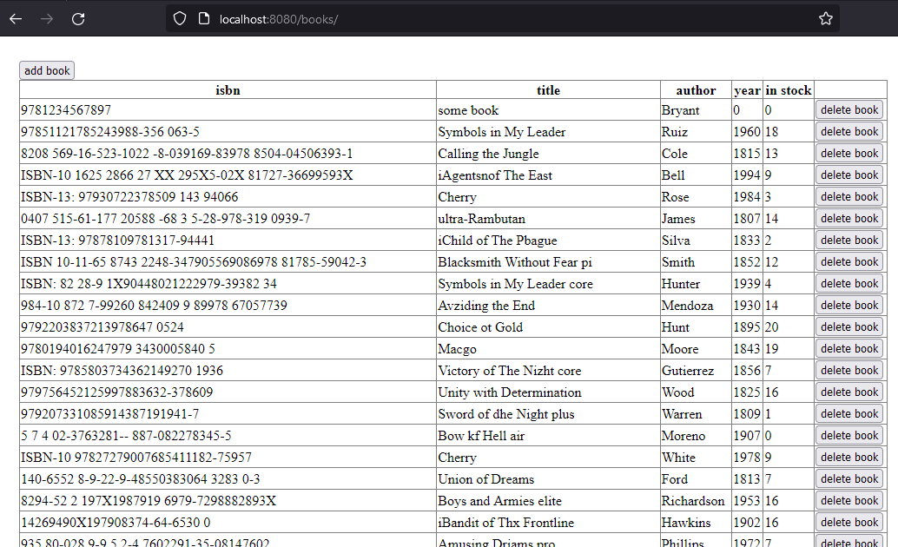

При добавлении кинги есть удобные списки, которые оторажают список существующих авторов.

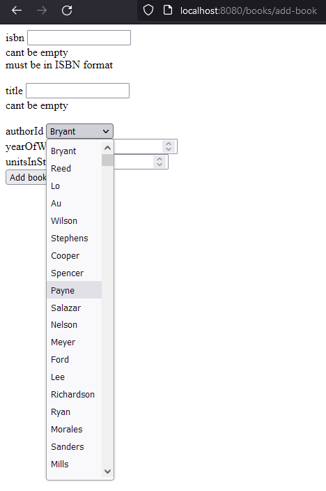

Затем эти значения подставляются в базу данных.

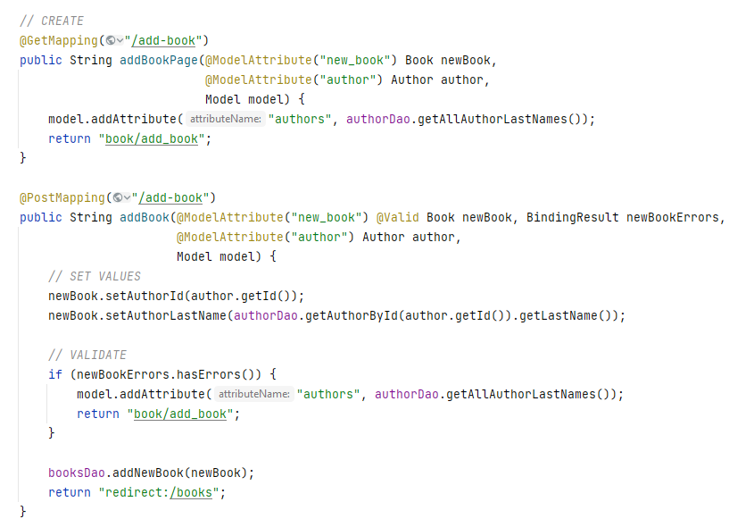

Для удобства, используется шаблонизатор Thymeleaf

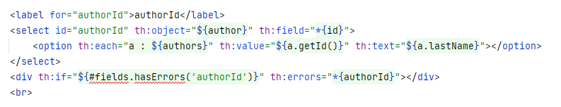

**Аренда**

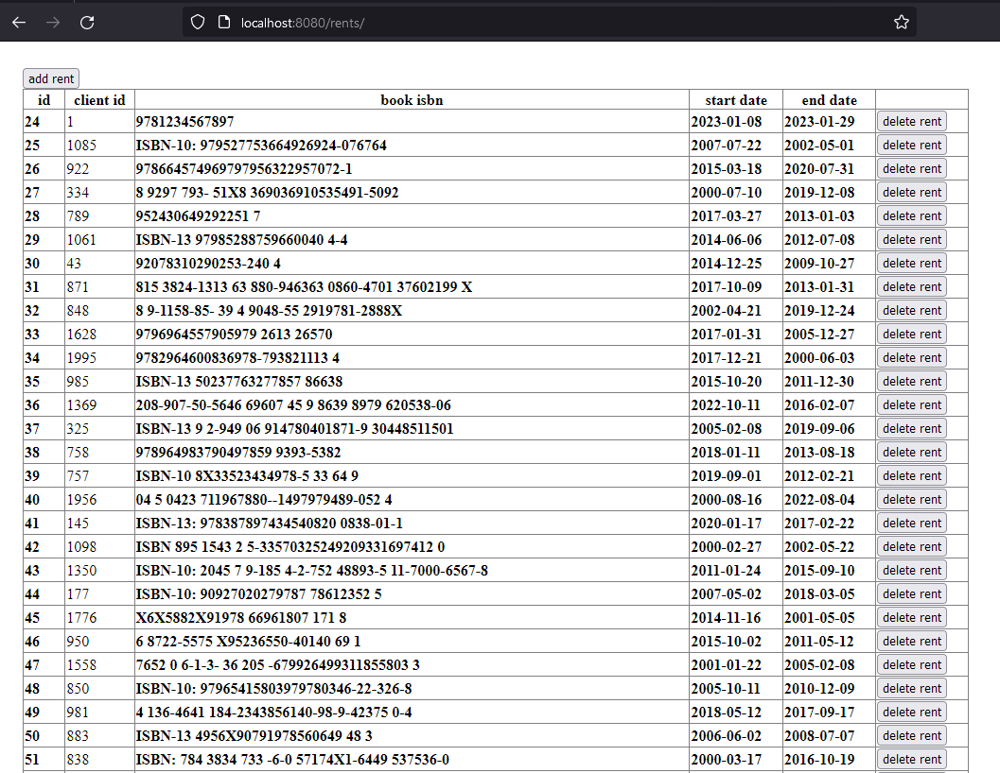
